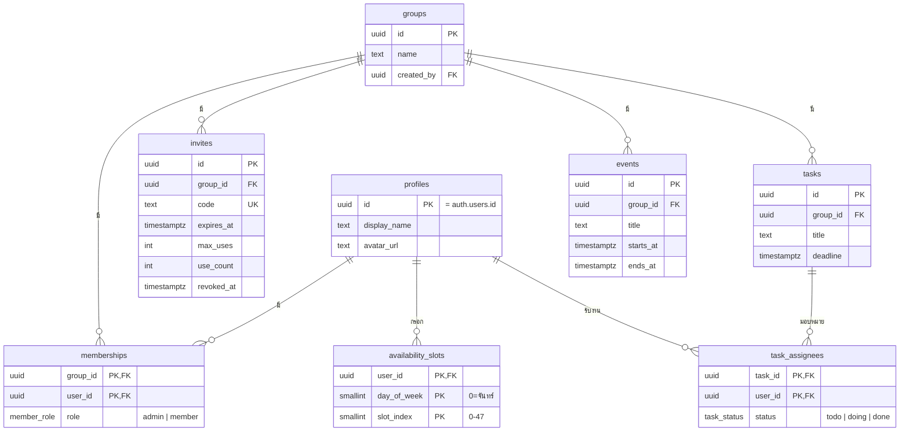
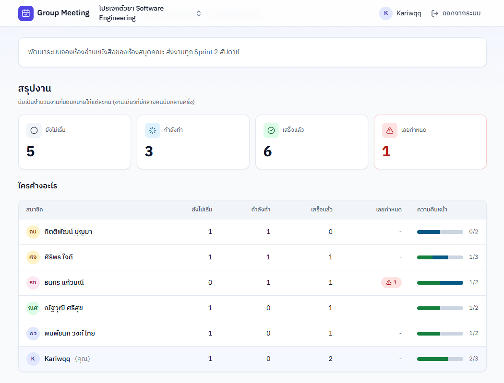
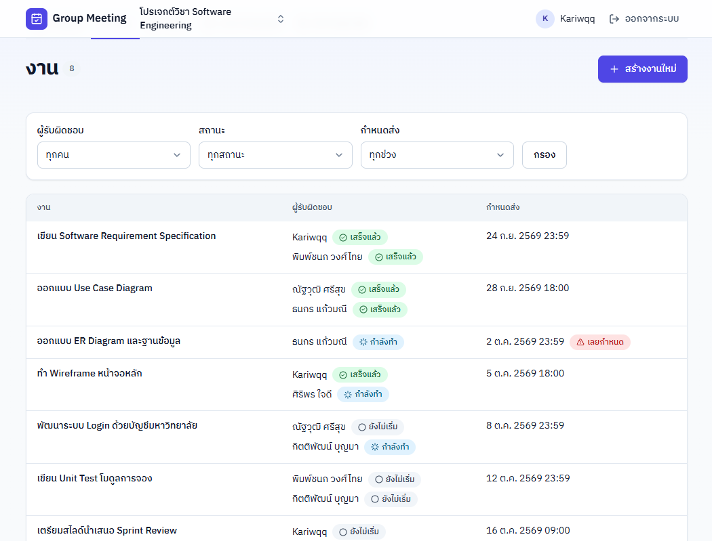
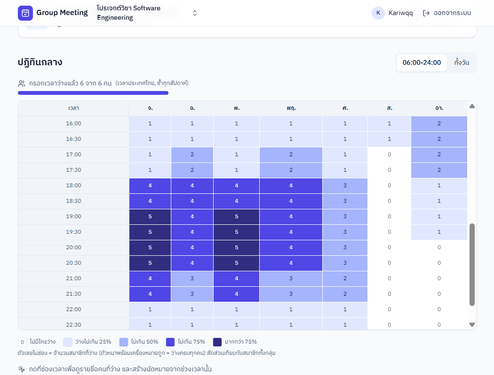
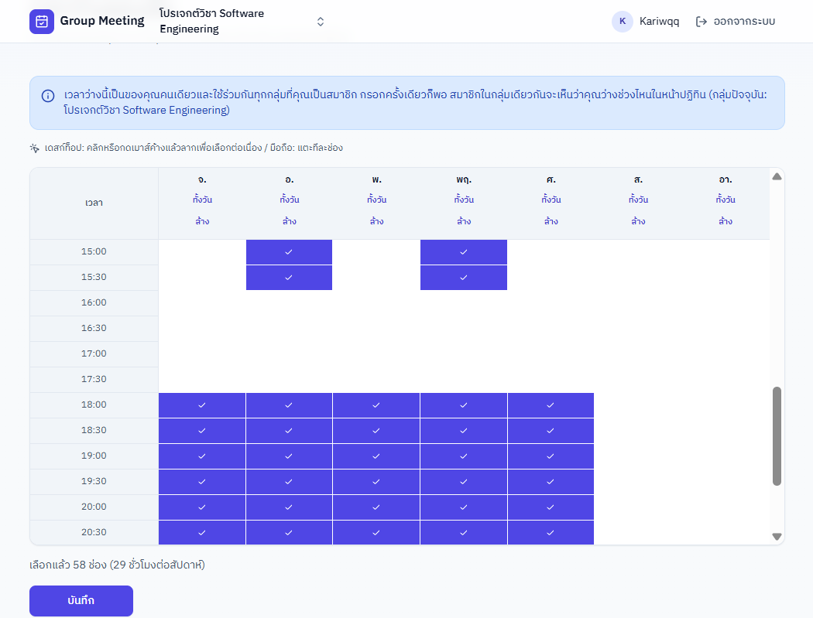
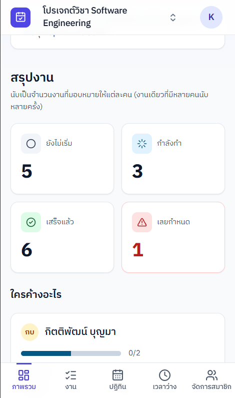

# Group Meeting

เว็บแอปจัดการงานและนัดเวลาสำหรับกลุ่มนักศึกษาขนาดใหญ่ (ชมรม, กิจกรรมคณะ, หลายสิบคน)

**เว็บจริง:** https://group-meeting-mauve.vercel.app (สมัครด้วยอีเมลหรือ login ด้วย Google)

## ปัญหาที่แก้

กลุ่มใหญ่ที่ใช้ LINE กลุ่มทำงานร่วมกันเจอ 2 เรื่อง

1. **ตามงานยาก** ข้อความจม ไม่รู้ว่าใครค้างอะไร
2. **นัดเวลาไม่ลงตัว** หาเวลาว่างตรงกันไม่ได้ และในกลุ่มใหญ่แทบไม่มีเวลาที่ทุกคนว่างพอดี

แนวทาง: ใช้ความโปร่งใสของสถานะแทนระบบเตือนอัตโนมัติ (dashboard เห็นทันทีว่าใครค้างอะไร) และใช้ heatmap
แทนการหาเวลาที่ทุกคนว่าง (เห็นว่าช่วงไหนมีคนว่างกี่คน แล้วให้ admin เลือกเอง)

## ฟีเจอร์

- **กลุ่มและสิทธิ์:** 1 user อยู่ได้หลายกลุ่ม, 2 บทบาท (admin / member), เชิญด้วยลิงก์หรือโค้ด
  (กำหนดจำนวนครั้งและวันหมดอายุได้), เปลี่ยน role, ลบสมาชิก, ออกจากกลุ่ม, ลบกลุ่ม
- **งาน:** admin สร้างงานพร้อม deadline และมอบหมายได้หลายคน, member อัปเดตสถานะของตัวเอง
  (todo / doing / done), dashboard "ใครค้างอะไร", filter ตามคน/สถานะ/deadline และ pagination
- **ปฏิทินกลาง:** กรอกเวลาว่างประจำสัปดาห์ครั้งเดียว (ช่องละ 30 นาที) ใช้ได้ทุกกลุ่ม,
  heatmap จำนวนคนว่างต่อช่วงเวลา, กดช่องดูรายชื่อว่าง/ไม่ว่าง, admin สร้างนัดหมายจากช่องที่เลือก
- **Auth:** email + password และ Google ผ่าน Supabase Auth

## Tech stack

| ส่วน | เทคโนโลยี |
|---|---|
| Framework | Next.js 16 (App Router), React 19, TypeScript |
| Styling | Tailwind CSS 4 |
| Backend | Supabase (PostgreSQL, Auth, Row Level Security) |
| Test | Vitest |
| Deploy | Vercel |

## สถาปัตยกรรมและการตัดสินใจสำคัญ

### 1. บังคับสิทธิ์ 3 ชั้น

| ชั้น | หน้าที่ | ที่อยู่ |
|---|---|---|
| `proxy.ts` | ต่ออายุ session และ redirect แบบ optimistic (UX) | `src/proxy.ts` |
| DAL / Server Actions | ตรวจ session และสิทธิ์ก่อนอ่านหรือเขียนข้อมูลทุกครั้ง | `src/lib/auth/dal.ts`, `src/lib/groups/dal.ts`, `src/lib/permissions` |
| Row Level Security | ด่านสุดท้ายที่ database ต่อให้ข้ามแอปก็ผ่านไม่ได้ | `supabase/migrations` |

เหตุผล: เอกสาร Next.js ระบุว่า proxy ไม่ควรเป็นแนวป้องกันเดียว การซ่อนปุ่มใน UI ไม่ใช่ความปลอดภัย
เพราะใครก็ยิง API ตรงๆ ได้ จึงต้องมี RLS ที่ database และมี test ยืนยัน

### 2. การเข้ากลุ่มผ่าน function ไม่ใช่ INSERT ตรง

ไม่มี policy INSERT บน `groups` และ `memberships` การสร้างกลุ่มและเข้ากลุ่มทำผ่าน
`create_group()` และ `join_group(code)` (`SECURITY DEFINER`) ที่ตรวจโค้ด, วันหมดอายุ, จำนวนครั้ง
และใส่ role เป็น `member` เท่านั้น ถ้าเปิด INSERT ตรง ใครก็ใส่ตัวเองเป็น admin ได้

### 3. สถานะงานเก็บรายคน (`task_assignees.status`)

งานที่มอบหมายหลายคนเสร็จไม่พร้อมกัน ถ้าเก็บสถานะที่ตัวงานตัวเดียวจะตอบไม่ได้ว่าใครค้าง
สถานะรวมของงานคำนวณจากสถานะของทุกคน และ "เลยกำหนด" คำนวณตอน query ไม่เก็บใน database
(ไม่ต้องมีงานคอยอัปเดต ซึ่งสอดคล้องกับการไม่มีระบบอัตโนมัติ)

### 4. เวลาว่างผูกกับ user ไม่ผูกกับกลุ่ม

กรอกครั้งเดียวใช้ได้ทุกกลุ่มที่อยู่ เก็บเป็น 1 แถวต่อ 1 ช่อง 30 นาที `(user_id, day_of_week, slot_index)`
เพราะ query และอธิบายง่ายกว่า bitmask และข้อมูลระดับกลุ่มหลักสิบคนมีไม่เกินหลักหมื่นแถว
`day_of_week` นับ 0 = จันทร์ (ไม่ใช่ `Date.getDay()` ที่ 0 = อาทิตย์) และเขตเวลาตายตัวเป็น `Asia/Bangkok`

### 5. Heatmap เป็น pure function

`src/lib/availability/heatmap.ts` รับแถวเวลาว่างกับรายชื่อสมาชิก กรองคนนอกกลุ่ม ค่านอกช่วง และแถวซ้ำ
แล้วนับลงกริด 7x48 ในรอบเดียว ทดสอบได้โดยไม่ต้องมี database

### 6. Server Components เป็นค่าเริ่มต้น

ดึงข้อมูลและตรวจสิทธิ์ฝั่ง server ใช้ Client Component เฉพาะที่ต้องมี state หรือ event จริง
(กริดกรอกเวลา, heatmap ที่กดได้, ฟอร์มที่ใช้ `useActionState`) ตัวกรองรายการงานเป็นฟอร์ม GET
ที่เก็บค่าใน URL จึงแชร์ลิงก์ได้และไม่ต้องมี client state

### 7. Trigger ปกป้องกฎที่ RLS ทำเองไม่ได้

RLS ตอบได้แค่ "แถวไหนแก้ได้" ไม่ใช่ "แก้เป็นค่าอะไร" จึงใช้ trigger กัน admin คนสุดท้ายหายไป,
กันย้ายแถว membership ข้ามกลุ่ม, ตรวจว่าผู้รับงานเป็นสมาชิกกลุ่ม และใช้ column-level privilege
(`grant update (status)`) จำกัดคอลัมน์ที่แก้ได้

## ER diagram



## สิทธิ์ (สรุป)

| การกระทำ | admin | member |
|---|---|---|
| ดูกลุ่ม งาน และปฏิทิน | ใช่ | ใช่ |
| สร้างและมอบหมายงาน | ใช่ | ไม่ |
| อัปเดตสถานะงานของตัวเอง | ใช่ (ถ้าเป็นผู้รับงาน) | ใช่ |
| เชิญสมาชิก / จัดการ role / ลบสมาชิก | ใช่ | ไม่ |
| กรอกเวลาว่างของตัวเอง | ใช่ | ใช่ |
| สร้างนัดหมาย | ใช่ | ไม่ |
| ลบกลุ่ม | ใช่ | ไม่ |

ตารางนี้ตรงกับ `src/lib/permissions` (มี test ครบทุกคู่ role x action) และกับนโยบาย RLS

## วิธีรันในเครื่อง

ต้องมี Node.js 22 ขึ้นไป

1. ติดตั้ง dependency: `npm install`
2. สร้างโปรเจกต์ที่ https://supabase.com (region Southeast Asia - Singapore)
3. เปิด SQL Editor แล้วรันไฟล์ใน `supabase/migrations` ตามลำดับเลขทีละไฟล์ (000001 ถึง 000006)
4. สร้างไฟล์ `.env.local` จาก `.env.example` แล้วใส่ค่า Project URL และ publishable (anon) key
   จาก Project Settings > API Keys (ห้ามใช้ `service_role` key ในแอปนี้)
5. ที่ Supabase > Authentication > URL Configuration ตั้ง Site URL เป็น `http://localhost:3000`
   และเพิ่ม Redirect URL `http://localhost:3000/**`
6. (ตอนพัฒนา) ปิด Confirm email ที่ Authentication > Sign In / Providers > Email
7. (ถ้าต้องการ Google) เปิด provider Google และตั้ง OAuth client ใน Google Cloud Console
8. `npm run dev` แล้วเปิด http://localhost:3000

## Test

```bash
npm test                  # unit test (Vitest)
npm run lint
npm run build
```

- Unit test ครอบคลุม logic หลัก: heatmap, การเช็คสิทธิ์ (`can`, `isLastAdmin`), filter/deadline/workload
  ของงาน, การแปลง slot เป็นเวลาจริง, การกัน open redirect
- ทดสอบ RLS กับ database จริง: วาง `supabase/tests/rls_smoke.sql` ใน Supabase SQL Editor
  สคริปต์ทำงานใน transaction เดียวแล้ว rollback จึงไม่ทิ้งข้อมูล
  กรณี race ของ admin คนสุดท้ายที่ลดสิทธิ์พร้อมกัน ทดสอบอัตโนมัติไม่ได้ ดูขั้นตอนทำมือท้ายไฟล์

หมายเหตุ: ถ้ารัน `tsc` ก่อน `next build` ครั้งแรกอาจฟ้อง type `PageProps` เพราะ route types ยังไม่ถูกสร้าง
ให้รัน `npx next typegen` หรือ build ก่อน

## Deploy บน Vercel

1. push โค้ดขึ้น GitHub แล้ว import โปรเจกต์ใน Vercel
2. ตั้ง Environment Variables: `NEXT_PUBLIC_SUPABASE_URL`, `NEXT_PUBLIC_SUPABASE_ANON_KEY`
   และ `SITE_URL` (origin ของเว็บจริง เช่น `https://your-app.vercel.app`)
3. ที่ Supabase เพิ่ม Site URL และ Redirect URL ของโดเมนจริง (`https://your-app.vercel.app/**`)
4. **เปิด Confirm email กลับ** ที่ Authentication > Sign In / Providers > Email
5. ตั้ง redirect URI ของ Google OAuth ให้ตรงกับโปรเจกต์ Supabase

## ข้อจำกัดที่รู้อยู่แล้ว

- **ลบบัญชีผู้ใช้แล้วกลุ่มที่เป็น admin คนเดียวถูกลบไปด้วย:** งานและนัดหมายในกลุ่มนั้นหายทั้งหมด ส่วนกลุ่มที่ยังมี admin คนอื่นยังอยู่ (`created_by` กลายเป็น null)
- **ไม่มี rate limit ของแอปเองที่ login/สมัคร:** Supabase เห็น IP ของ server Vercel ไม่ใช่ IP ผู้ใช้
- **admin ทุกคนมีสิทธิ์เท่ากัน:** admin คนไหนก็ลด/ลบ admin คนอื่นได้ (กันกลุ่มไม่มี admin ด้วย trigger)
- **การสร้างงานพร้อมผู้รับผิดชอบ และการบันทึกเวลาว่าง ไม่ใช่ transaction เดียว:** ทำจากฝั่งแอป
  หากต้องการ atomic จริงควรเพิ่ม RPC ใน database
- **Dashboard คำนวณใน JavaScript:** ดึงข้อมูลเป็นก้อน (เพดาน 10,000 แถวการมอบหมาย พร้อมคำเตือน)
  กลุ่มที่ใหญ่กว่านี้ควรย้ายไปคำนวณใน database ด้วย view หรือ RPC
- **ไม่มี rate limit ต่อการเดาโค้ดเชิญ:** โค้ดสุ่มยาว 12 ตัว (~48 บิต) และตอบ error เดียวกันทุกกรณี
- **เขตเวลาคงที่ Asia/Bangkok** ไม่รองรับกลุ่มต่างเขตเวลา
- **ไม่ทำ (ตามขอบเขต):** LINE ทุกรูปแบบ, ระบบเตือนอัตโนมัติ (email/push), ทีมย่อยในกลุ่ม, แอปมือถือ

## Screenshot

ถ่ายจากแอปที่รันกับ Supabase จริง ใช้ข้อมูลตัวอย่างจาก `supabase/seed/demo_data.sql`
(ลบได้ด้วย `supabase/seed/demo_cleanup.sql`)

**ภาพรวมกลุ่ม: สรุปงานและ "ใครค้างอะไร"**



**รายการงานพร้อม filter และสถานะรายคน**



**ปฏิทินกลาง: heatmap ช่วงเวลาที่สมาชิกว่างตรงกัน**



**กรอกเวลาว่างของฉัน**



**มุมมองบนมือถือ (375px)**


